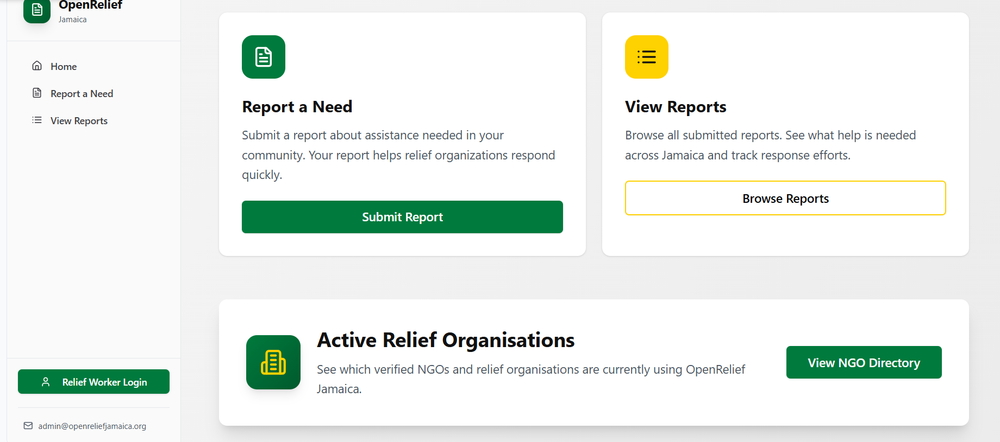
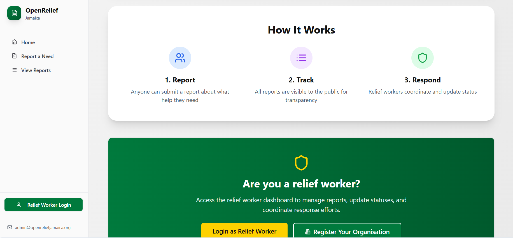

# Frontend Documentation — OpenRelief Jamaica

The frontend of OpenRelief Jamaica is built using Base44’s React-style UI builder.  
It delivers a clean, fast, mobile-first interface that allows citizens and relief workers to interact with the system in real time.

This documentation shows the full user journey with annotated screenshots.

---

##  Overview of User Flows

OpenRelief Jamaica provides three primary user experiences:

1. **Citizens reporting needs** (food, water, medical help, shelter)
2. **Relief workers viewing, validating and responding to reports**
3. **NGOs registering and managing their active status**

The UI is designed for **speed, clarity, and emergency-friendly usability**.

---

##  Home Page

The home screen introduces the platform and gives users quick access to key features.

### Screenshot


### Key Features
- Hero banner with brand identity  
- Quick-link cards: “Report a Need” and “View Reports”  
- CTA for relief workers to login  
- Clean, emergency-focused colour palette  

---

##  Report a Need Page

Citizens can quickly submit urgent needs and provide information about their household, situation, and contact info.

### Screenshot


### Functionality
- Simple form for faster reporting  
- Collects structured data for accurate relief routing  
- Fields: parish, community, description, household size, etc.  
- Automatically pushes entries to the backend API  

---

##  View Reports Page

Displays all submitted reports in real time, enabling transparency and coordination.

### Screenshot


### Functionality
- Filterable list of disaster/need reports  
- Publicly visible for transparency  
- Relief teams can track locations and statuses  

---

##  Active Relief Organisations

Verified NGOs and relief teams can view and manage their participation.

### Screenshot


### Functionality
- Shows active organisations  
- Allows new NGOs to register  
- Connects citizens to legitimate responders  

---

##  UI Principles

The frontend is built around four core design principles:

- **Clarity:** minimal steps, simple language  
- **Speed:** optimised for poor network conditions  
- **Safety:** no personal data exposed publicly  
- **Consistency:** unified colour + component system  

---

##  Components Used

Reusable UI components include:

- StatusBadge  
- ReportCard  
- NGOCard  
- NavSidebar  
- FormInput / Select  
- Loader and Error States  

These components reduce friction and standardise behaviour across the app.

---

##  Frontend Folder Structure

```
/docs/frontend
    /screen
        home-1.png
        home-2.png
        home-3.png
        home-4.png
    README.md
```

---

##  Summary

This frontend demonstrates a fully functional emergency-response interface  
showing:

- Real user flows  
- Real UI/UX decisions  
- Real integration with a live backend API  
- Real screenshots of a working system  

This is production-quality evidence of a complete application.

